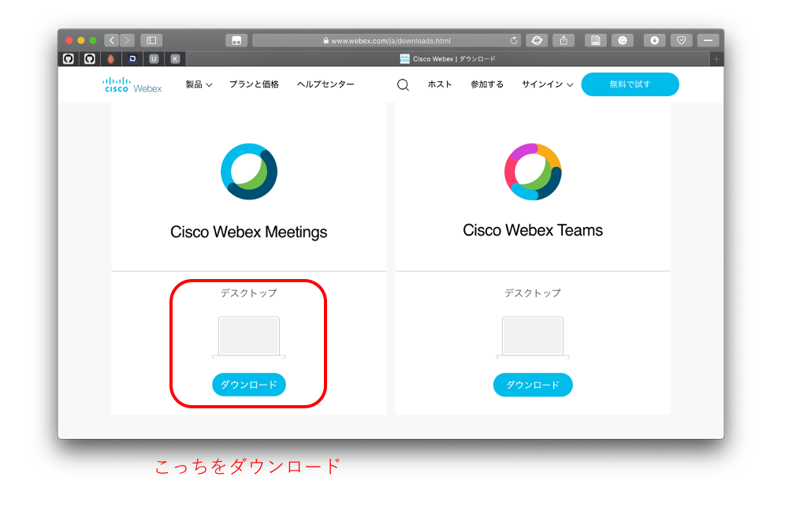
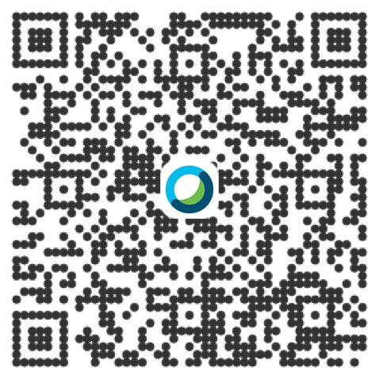

# ［学生向け］Webexの使い方

## 全体の流れ

1. [STEP 1. 1度だけ行う準備](#prepare_once)
    1. [STEP 1-1. アプリのインストール](#app_install)

1. 講義の前に行う準備
   1. 会議室への入室

1. 受講

- [参考資料](#references)

<h2 id="prepare_once">STEP 1. 1度だけ行う準備</h2>

<h3 id="app_install">STEP 1-1. アプリのインストール</h3>

まず，ビデオ会議用のアプリケーションである「Cisco Webex Meetings」をインストールします。

通常は，講義参加用のURLをブラウザで開くと，使っているデバイスに合わせてアプリがダウンロードされます。
しかし，スムーズに講義に参加するためには，予めアプリをインストールしておいた方が良いでしょう。

- PC/Macの場合
    - [Cisco Webexダウンロード](https://www.webex.com/ja/downloads.html)にアクセスして「Cisco Webex Meetings」をダウンロード
    

- iOSの場合
    - App Storeで「Cisco Webex Meetings」を検索してインストール
    - または下のQRコードをデバイスでスキャンします。
    

- Androidの場合
    - Google Play StoreまたはAmazon Appstore for Android（機種によって異なります）で「Cisco Webex Meetings」を検索してインストール

<h2 id="references">参考資料</h2>

- [Webex Meetingsの会議マニュアル（動画）](https://www.cisco.com/c/m/ja_jp/solutions/webex/how-to-use.html)  
会議の予約，参加，画面共有，録画・保存など，基本的な使い方に関する説明ビデオ集です。
- [WebExミーティングの進行管理（PDF）](https://www.cisco.com/c/dam/global/ja_jp/td/docs/wc/webconferencing/webexmeetingcenterwbs30/ug/004/b-manage-meetings-ja-jp.pdf)  
  ホワイトボードや投票，メモ（議事録）など講義に便利な機能についての説明があります。
- [テレワークを快適にするCisco Webex TIPS集（PDF）](https://www.cisco.com/c/dam/m/ja_jp/solutions/webex/pdf/cisco-webex-tips-japanese.pdf)  
  講義の運営，参加する場合のちょっとした心がけ集です。
